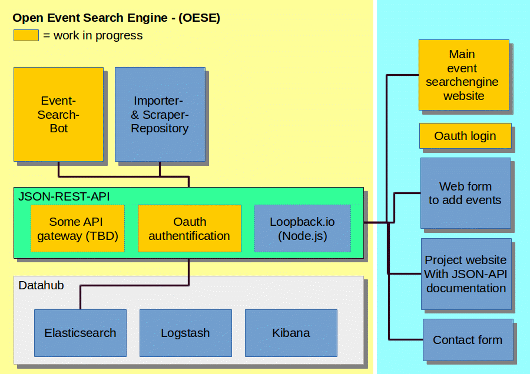

Open Events Database
====================

Welcome to the code repository of the Open Event Search Engine (OESE) and Open Events Database project.

We have a fancy project homepage here: http://events.input23.de


Install
-------
If you want to run the Events Database, you only need to install docker and docker-compose.

If you are on a newer Ubuntu Version follow the instructions of: https://gist.github.com/wdullaer/f1af16bd7e970389bad3


###Run the Elasticsearch instance and import event data

1. Start ElasticSearch, Kibana:
   ```bash
   [sudo] docker-compose up -d
   ```
2. Setup the elasticsearch index:

   (You only need to do this once before the first run of the event importers)
   ```bash
   cd elasticserch;./create_index.sh
   ```
3. Run the importers to import data into your elasticsearch instance: Check out the directory `scripts` and run the import engines of your desired regions or event types.

   E.g. for the Münster events this would be:
   ```bash
   cd scripts
   cd scrapers-muenster
   ./install.sh
   perl muenster-scraper.pl
   ```

###Run the JSON REST API
In order to start it, you just need to `docker-compose up` and then start the Strongloop Loopback API Server. Check out the details in [our detailed readme for strongloop](loopback-api/open-events/README.md).


Then you can check out the following urls:
* Use the Sense interface to run queries on the database: http://localhost:5601/app/sense
* Explore the data using Kibana: http://localhost:5601


Example elasticsearch queries
-----------------------------

```bash
# geo location query for events
curl -XGET localhost:9200/events/event/_search?pretty=true -d '
{
         "query" : {
             "match_all" : {}
         },
         "filter" : {
             "geo_distance" : {
                 "distance" : "10km",
                 "event.location.geo" : {
                     "lat" : "51.96066",
                     "lon" : "7.62613"
                 }
             }
         }
}
'
```

[Check out the ElasticSearch example queries page](elasticsearch/README.md)


FAQ
---
* *What is planned for this project?*
  Here is an old post from the forum: (in german) http://forum.codeformuenster.org/t/open-calendar-offene-termindatenbank/109
* *How can I help?* If any of the project parts are interesting for you (search engine, website scraping, search engine frontend), please check out the contact information on our project page http://events.input23.de or check out the github issues.


Structure Diagram
-----------------
The architecture of the Sytem is based on the following diagram:



right side (light blue) = frontend, left side (yellow) = backend
